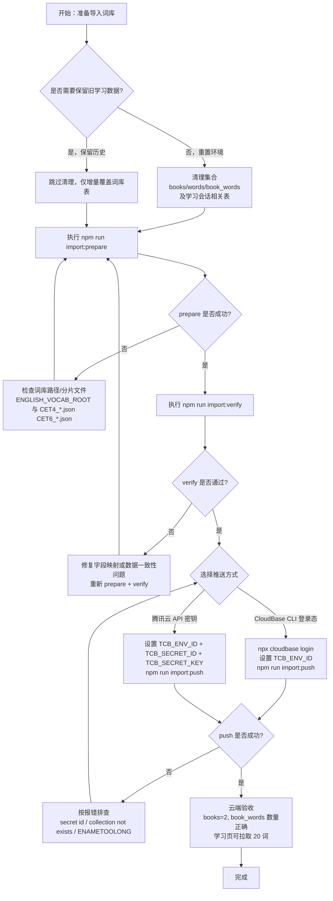

# 导入脚本说明（CET4/CET6）

本文档用于说明当前项目词库导入脚本的完整使用方式，覆盖：

- 数据来源与字段口径
- 执行步骤（prepare / verify / push）
- 导入前清理建议
- 常见问题排查

---

## 1. 当前导入口径

当前脚本已统一为“正式口径”：

- 词书范围：`cet4`、`cet6`
- 数据源：`english-vocabulary-master/json_original/json-sentence`
- 分片策略：自动合并
  - CET4：`CET4_1.json + CET4_2.json + CET4_3.json`
  - CET6：`CET6_1.json + CET6_2.json + CET6_3.json`
- 默认导入条数：全量（`IMPORT_WORD_LIMIT=0`）
- 抽样导入：设置 `IMPORT_WORD_LIMIT>0` 可截取前 N 条

导入集合：

- `books`
- `words`
- `book_words`

---

## 2. 脚本文件说明

- `scripts/import/prepare-dataset.js`
  - 生成导入 JSON
  - 输出到 `scripts/import/data/`
- `scripts/import/verify-import.js`
  - 校验 JSON 结构与关联一致性
- `scripts/import/push-to-cloud.js`
  - 推送到微信云开发数据库
  - 支持两种认证方式：
    - 腾讯云 API 密钥（`TCB_SECRET_ID`/`TCB_SECRET_KEY`）
    - CloudBase CLI 登录态（`npx cloudbase login`）

---

## 3. 导入前建议（清理清单）

为避免旧测试数据影响，建议先清理数据库。

### 3.1 必清（词库表）

- `books`
- `words`
- `book_words`

### 3.2 强烈建议清（学习会话相关）

- `user_word_state`
- `study_sessions`
- `study_session_word_progress`
- `study_logs`
- `user_learning_stats`
- `user_book_settings`
- `user_learn_settings`

### 3.3 不建议清（除非你要全量重置）

- 用户认证相关表（用户账号、会话 token、密码重置记录等）

---

## 4. 执行步骤

在项目根目录执行：

```bash
npm run import:prepare
npm run import:verify
```

若校验通过，再推云端：

```bash
npm run import:push
```

---

## 5. 环境变量说明

### 5.1 基础变量

- `ENGLISH_VOCAB_ROOT`
  - 词库根目录
  - 默认：项目同级目录 `../english-vocabulary-master`
- `IMPORT_WORD_LIMIT`
  - `0` 或不传：全量
  - `>0`：每本词书截取前 N 条
- `TCB_ENV_ID`
  - 云开发环境 ID（如 `cloud1-xxxx`）

### 5.2 推送认证变量（可选）

- `TCB_SECRET_ID`
- `TCB_SECRET_KEY`

如果不提供上述两个变量，`import:push` 会走 CloudBase CLI 登录态。

---

## 6. 推荐命令示例（Windows）

### 6.1 全量导入

```bat
set IMPORT_WORD_LIMIT=0
npm run import:prepare
npm run import:verify
```

### 6.2 抽样导入（每本 50 条）

```bat
set IMPORT_WORD_LIMIT=50
npm run import:prepare
npm run import:verify
```

### 6.3 使用 CLI 登录态推送

```bat
npx cloudbase login
set TCB_ENV_ID=cloud1-8gz4j99a63c679e0
npm run import:push
```

### 6.4 使用腾讯云密钥推送

```bat
set TCB_ENV_ID=cloud1-8gz4j99a63c679e0
set TCB_SECRET_ID=你的SecretId
set TCB_SECRET_KEY=你的SecretKey
npm run import:push
```

---

## 7. 校验通过标准

`npm run import:verify` 通过时，至少应满足：

- `books` 正好 2 条（`cet4`、`cet6`）
- `book_words` 的 `word_id` 都能在 `words._id` 命中
- `book_words` 的 `seq` 连续
- `books.word_count` 与对应 `book_words` 条数一致

正式全量规模（参考）：

- `book_words cet4`: 7508
- `book_words cet6`: 5651

---

## 8. 常见问题

### 8.1 `database collection not exists`

原因：云数据库缺少某集合。  
处理：在云开发控制台手动创建对应集合（例如 `books/words/book_words`）。

### 8.2 `secret id error` / `SIGN_PARAM_INVALID`

原因：使用了错误密钥（如 CLI 密钥），或环境变量无效。  
处理：

- 改用腾讯云 API 密钥（`SecretId/SecretKey`），或
- 改走 `npx cloudbase login` 的 CLI 登录态。

### 8.3 `ENAMETOOLONG`

原因：Windows 命令行参数长度超限。  
处理：已在脚本内实现按命令长度动态分批，无需手动处理；更新后重试即可。

---

## 9. 导入后验证建议

导入完成后，建议快速检查：

1. `books` 里能看到 `cet4`、`cet6`
2. `book_words` 条数符合预期
3. 进入学习页时，`getLearnWords` 能取到 20 个词
4. 单词详情字段（`translations/phrases/sentences`）正常返回

---

## 10. 导入流程图（答辩展示版）



---

## 11. 6 步超简版流程图（PPT 一页）


